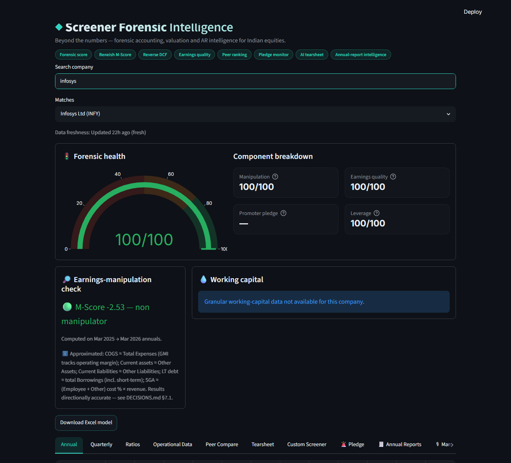
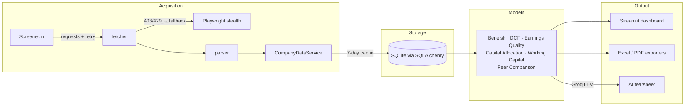

# Screener Finance Tool

Type an Indian company's name — get its financial statements, forensic
accounting checks, peer ranking, and an AI-written one-page investment
tearsheet. Data is scraped from [Screener.in](https://www.screener.in),
cached in SQLite, and served through a Streamlit dashboard.



## Live App

> 🔗 **Live URL:** _coming soon — deploy steps below_
<!-- After deploying, replace with: https://<your-app>.streamlit.app -->

## Features

- **Company search** with live autocomplete against Screener's API
- **Annual / Quarterly / Ratios** statement tabs with a data-freshness indicator (7-day scrape cache)
- **Beneish M-Score** earnings-manipulation check with a red/green flag
- **Working-capital heatmap** (DSO / DIO / DPO / CCC by period, Plotly)
- **Peer comparison** — auto-discovers sector peers, ranks by ROCE, ROE, revenue growth and a weighted composite score
- **AI tearsheet** — a one-page plain-English summary (trends, red flags, peer view, overall view) generated via the **Groq API** (free tier; this project deliberately never uses paid LLM APIs)
- **Custom formula screener** — define your own metric (e.g. `(pat / revenue) * revenue_growth_3yr`) and rank every downloaded company; formulas are AST-sandboxed (arithmetic only, can never execute code)
- **Excel export** of all parsed statements; PDF export of tearsheets; **colour-scale CCC heatmap in Excel** (conditional formatting per metric row)
- **Forensic models**: Beneish M-Score, forward & reverse DCF, earnings quality (CFO/PAT, accruals), capital-allocation score (ROIC vs WACC), cash-conversion cycle
- **Promoter pledge risk monitor** — parses pledge history, flags >20%/>40% crossings and rising trends, cross-references crossings with subsequent price drops (India-specific red flag)
- **Management credibility tracker** — extracts quantified guidance from earnings-call transcripts (Groq), pairs it with delivered actuals, and scores hit-rate + bias 0–10
- **Annual-report downloader** — stealth Playwright fetcher with IR-page → NSE → BSE fallback chain, rotating user agents, 15s+ randomised BSE delays, and a local PDF cache (local use only)

## Architecture



Everything configurable (URLs, thresholds, cache windows, model weights) lives
in [config.yaml](config.yaml) — nothing is hardcoded.

## Run Locally

```bash
git clone <this-repo>
cd "Finance Project"
python -m venv .venv
.venv\Scripts\activate            # Windows  (source .venv/bin/activate on macOS/Linux)
pip install -r requirements-dev.txt
playwright install chromium       # optional: enables the blocked-scrape fallback

copy .env.example .env            # then put your Groq key in .env
streamlit run streamlit_app.py
```

Get a free Groq API key at <https://console.groq.com/keys>. Without it the app
works fully except the AI tearsheet tab.

## Deploy to Streamlit Community Cloud

1. Push this repository to GitHub.
2. At [share.streamlit.io](https://share.streamlit.io), create an app pointing at `streamlit_app.py` (Python 3.11).
3. In **App → Settings → Secrets**, paste the contents of
   [.streamlit/secrets.toml.example](.streamlit/secrets.toml.example) with your real key:
   ```toml
   GROQ_API_KEY = "gsk_..."
   ```
4. Deploy — then paste the app URL into the **Live App** section above.

Notes for the cloud environment:
- `requirements.txt` is pinned and minimal (no Playwright — the HTTP scraper handles the normal path; the browser fallback and AR downloader are local-only features).
- The SQLite cache is ephemeral on Community Cloud (resets on app restarts); data simply re-scrapes.

## Tests & CI

```bash
pytest                                   # 318 tests
pytest --cov=screener --cov-fail-under=70   # coverage gate (currently ~93%)
```

GitHub Actions ([.github/workflows/ci.yml](.github/workflows/ci.yml)) runs the
full suite with the coverage gate on every push and pull request.

## Project Structure

```
screener/
  scraper/       data collection: HTTP client, Playwright fallback,
                 Screener parser, acquisition service, AR downloader
  models/        financial calculations: Beneish, DCF (fwd + reverse),
                 earnings quality, capital allocation, working capital,
                 peer comparison, pledge monitor, management credibility,
                 custom formula screener, ratios
  database/      SQLite layer: ORM models, repositories, 7-day cache
  exporters/     Excel, PDF, WC heatmap (colour scales), AI tearsheet (Groq)
  ui/            Streamlit app + pure view helpers
  tests/         pytest suite (fixtures only — no live network calls)
```

## Disclaimer

For research and education. Not investment advice. Respect Screener.in's terms
of service and rate limits when scraping.
