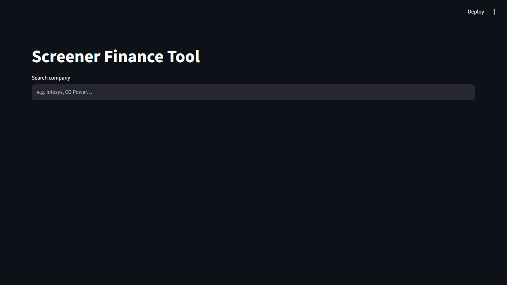
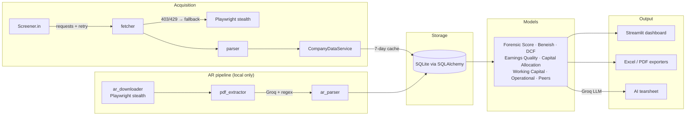

# Screener Finance Tool

Type an Indian company's name — get its financial statements, forensic
accounting checks, peer ranking, and an AI-written one-page investment
tearsheet. Data is scraped from [Screener.in](https://www.screener.in),
cached in SQLite, and served through a Streamlit dashboard.



*Live demo: searching Infosys, the Beneish M-Score computed on real data with
its data-quality disclosure, statement tabs, the custom formula screener, and
the pledge monitor.*

## Live App

> 🔗 **Live URL:** _coming soon — deploy steps below_
<!-- After deploying, replace with: https://<your-app>.streamlit.app -->

## What makes it different from Screener

Screener.in is a **data terminal** — superb at raw numbers, ratios and charts. This tool adds the **interpretation layer** Screener deliberately doesn't: forensic accounting checks, an aggregate health score, AR-vs-Screener data reconciliation, and an AI tearsheet. *Screener gives you the data; this gives you the judgment.*

## Features

- **🚦 Forensic Red-Flag score** — one 0–100 health number aggregating Beneish, earnings quality, promoter-pledge risk and leverage, with a per-component breakdown. The headline differentiator (no free Indian tool publishes an aggregated forensic score).
- **Company search** with live autocomplete; **Annual / Quarterly / Ratios** tabs with a data-freshness indicator (7-day scrape cache).
- **Beneish M-Score** earnings-manipulation check with red/green flag and per-field data-quality disclosure; upgrades to **exact Annual-Report figures** when available (un-neutralising DSRI/TATA).
- **Operational Data tab** — margins, asset/inventory turnover, working-capital days (DSO/DIO/DPO/CCC), cash conversion, derived from the statements.
- **Working-capital heatmap** (Plotly) + a **colour-scale CCC heatmap in Excel**.
- **Peer comparison** — auto-discovers *industry-correct* sector peers and ranks by ROCE, ROE, revenue growth and a composite score, with live progress.
- **AI tearsheet** — one-page plain-English summary via the **Groq API** (free tier; this project deliberately never uses paid LLM APIs), enriched with exact AR data when present.
- **Custom formula screener** — define your own metric (e.g. `(pat / revenue) * revenue_growth_3yr`); formulas are **AST-sandboxed** (arithmetic only, can never execute code).
- **🚨 Promoter pledge risk monitor** — pledge-history chart with threshold bands, green/amber/red badge, crossing alerts, price-drop cross-referencing (India-specific red flag).
- **🧾 Annual Reports tab** — exact extracted figures, **Screener-vs-AR discrepancy flags** (restatement detector), and a multi-year **key-risk timeline**.
- **🎙 Management tab** — guidance-vs-delivery **credibility score** (hit-rate + bias) from extracted guidance.
- **Excel model export** — template-style PL/BS/CF/Quarterly/Operational + Notes sheets, plus AR Financials / Screener-vs-AR / Risk Timeline when AR data exists.
- **Annual-report pipeline** (local-only) — stealth Playwright downloader (IR → NSE → BSE, rotating UAs, 15s+ BSE delays, PDF cache) → pdfplumber text extraction → Groq structured extraction (regex fallback) → SQLite. See *local vs hosted* below.

## Architecture



Everything configurable (URLs, thresholds, cache windows, model weights) lives
in [config.yaml](config.yaml) — nothing is hardcoded.

## Run Locally

```bash
git clone <this-repo>
cd "Finance Project"
python -m venv .venv
.venv\Scripts\activate            # Windows  (source .venv/bin/activate on macOS/Linux)
pip install -r requirements-dev.txt
playwright install chromium       # optional: enables the blocked-scrape fallback

copy .env.example .env            # then put your Groq key in .env
streamlit run streamlit_app.py
```

Get a free Groq API key at <https://console.groq.com/keys>. Without it the app
works fully except the AI tearsheet tab.

## Deploy to Streamlit Community Cloud

1. Push this repository to GitHub.
2. At [share.streamlit.io](https://share.streamlit.io), create an app pointing at `streamlit_app.py` (Python 3.11).
3. In **App → Settings → Secrets**, paste the contents of
   [.streamlit/secrets.toml.example](.streamlit/secrets.toml.example) with your real key:
   ```toml
   GROQ_API_KEY = "gsk_..."
   ```
4. Deploy — then paste the app URL into the **Live App** section above.

Notes for the cloud environment:
- `requirements.txt` is pinned and minimal (no Playwright — the HTTP scraper handles the normal path; the browser fallback and AR pipeline are local-only features).
- The SQLite cache is ephemeral on Community Cloud (resets on app restarts); data simply re-scrapes.

## Local vs hosted

The system is split so the cloud limit never blocks you:

- **Hosted (Streamlit Cloud):** the full dashboard, forensic score, Beneish, peers, operational, pledge, custom screener, Excel export and the AI tearsheet — all on Screener-sourced data.
- **Local only:** the **AR pipeline** (Playwright + Groq) that downloads annual-report PDFs and extracts exact figures. Run it on your machine (residential IP, installed Chromium); it populates the SQLite DB, after which the 🧾 Annual Reports / 🎙 Management tabs and the AR-upgraded Beneish read from that data. Rationale in [DECISIONS.md §15](DECISIONS.md).

## Tests & CI

```bash
pytest                                   # 457 tests
pytest --cov=screener --cov-fail-under=70   # coverage gate (currently ~92%)
```

Design rationale for the non-obvious choices (Groq over Claude, SQLite over
Postgres, AST sandboxing over eval, Beneish approximations) lives in
[DECISIONS.md](DECISIONS.md).

GitHub Actions ([.github/workflows/ci.yml](.github/workflows/ci.yml)) runs the
full suite with the coverage gate on every push and pull request.

## Project Structure

```
screener/
  scraper/       data collection: HTTP client (retry/jitter), Playwright
                 fallback, Screener parser, schedules (notes) enrichment,
                 acquisition service (consolidated→standalone), AR downloader,
                 pdf_extractor, ar_parser, ar_pipeline
  models/        forensic_score, beneish (+ AR adapter), DCF (fwd + reverse),
                 earnings quality, capital allocation, working capital,
                 operational, peer comparison, pledge monitor,
                 management credibility, ar_insights, custom screener, ratios
  database/      SQLite layer: ORM models (incl. ARExtractedData), repositories,
                 7-day cache
  exporters/     Excel model workbook (+ AR sheets), PDF, WC heatmap, tearsheet
  ui/            Streamlit app (10 tabs) + pure view helpers
  tests/         pytest suite (fixtures/mocks only — no live network calls)
```

## Disclaimer

For research and education. Not investment advice. Respect Screener.in's terms
of service and rate limits when scraping.
